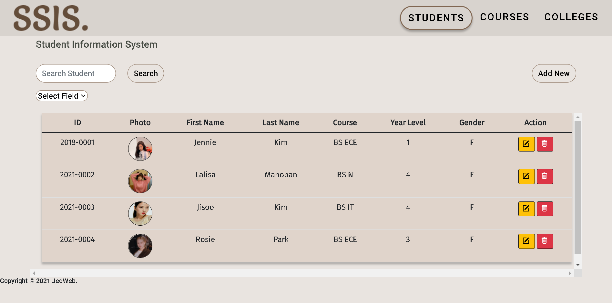

# SSIS-WEB-BASED-APP



# MAIN FEATURES
DISPLAY DATA <br />
CREATE DATA <br />
UPDATE DATA <br />
DELETE DATA <br />
SEARCH DATA <br />

## Installation

1. Clone the repository to your Local folder

```bash
clone 'https://github.com/edejeed/SSIS-WEB-BASED-APP.git'
```

2. Configure your dotenv file

3. Create .env file and write the following:

```bash
SECRET_KEY=any
DB_NAME=Student
DB_USERNAME=database_username
DB_PASSWORD=database_password
DB_HOST=database_host
```
4. Create .flaskenv file and write the following:

```bash
FLASK_APP=app
FLASK_ENV=development
FLASK_RUN_PORT=8080
```

5. Create .flaskenv file and write the following:


Load the script SQL to your MYSQL IDE


## RUN THE APP

1. Activate Virtualenv
```bash
.\env\Scripts\activate
```

2. RUN THE APP
```bash
flask run
```
